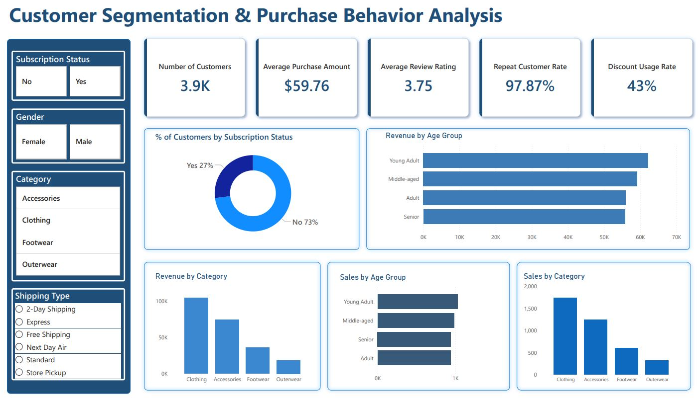

# Customer-Segmentation-Purchase-Behavior-Analysis
Analyzing customer purchase behavior and segmenting customers using demographic and transactional data. This project utilizes Python for data cleaning &amp; EDA, SQL for analysis and Power BI for visualizations to uncover insights into spending patterns, product preferences and subscription behavior.

## Project Overview
This project focuses on analyzing customer purchase behavior and segmenting customers based on their demographic and transactional data. The goal is to identify patterns in customer spending, review ratings and shipping preferences. This analysis is performed using **Python** for data cleaning and exploration, **SQL** for querying the dataset and **Power BI** for data visualization.

## Data Overview
The dataset consists of 3900 customer records and includes the following key columns:

- **Customer ID**: Unique identifier for each customer.
- **Age**: Customer's age.
- **Gender**: Customer's gender.
- **Item Purchased**: The product the customer purchased.
- **Category**: Category of the purchased item (e.g., Clothing, Footwear).
- **Purchase Amount (USD)**: The amount spent by the customer in USD.
- **Location**: Customer's geographical location.
- **Size, Color, Season**: Attributes of the purchased item.
- **Review Rating**: Rating given by the customer for the purchased item.
- **Subscription Status**: Whether the customer is subscribed to the service.
- **Shipping Type**: Shipping method chosen by the customer (e.g., Standard, Express).
- **Discount Applied**: Whether a discount was applied to the purchase.
- **Promo Code Used**: Whether a promo code was used.
- **Previous Purchases**: Number of purchases made by the customer in the past.
- **Payment Method**: Payment method used for the purchase (e.g., Credit Card, PayPal).
- **Frequency of Purchases**: How often the customer makes a purchase.

## Python Data Cleaning and EDA

### Data Loading and Initial Exploration
The dataset was loaded using **pandas** for further analysis. After loading the data, I conducted an initial exploration using functions like `.info()` and `.describe()` to understand the structure of the dataset and check for missing values, data types, and basic statistics.

### Missing Data Handling
There were some missing values in the **Review Rating** column. To ensure that the analysis was not biased by these missing values, I imputed the missing **Review Rating** data with the median of the respective product category. This method ensured that the data remained representative without introducing bias.

### Column Renaming
To improve readability and consistency, I standardized the column names to use snake case. This practice made the columns easier to reference in the code and reduced any potential errors caused by inconsistent naming conventions.

### Feature Engineering
I created new features to enhance the analysis:
- **Age Group**: I segmented customers into different age groups (Young Adult, Middle-aged, Senior) using **quantile-based binning** to better understand behavior across age demographics.
- **Purchase Frequency**: I mapped the frequency of purchases (e.g., Weekly = 7 days) to numerical values to quantify how often customers make purchases.

## SQL Queries for Analysis

### Total Revenue by Gender
In the SQL analysis, I calculated the total revenue generated by male and female customers. This analysis provided insights into how revenue is distributed between genders, helping to identify potential target markets or trends.

### Customers Using Discount but Spending More than Average
This query identifies customers who used a discount but still spent more than the average purchase amount. This helps in pinpointing high-spending customers who respond to promotions and discounts.

### Top 5 Products by Review Rating
I selected the top 5 products with the highest average review ratings. This analysis allows the company to identify the most highly rated products and potentially highlight these in marketing efforts.

### Average Purchase Amount by Shipping Type
I compared the average purchase amounts for **Standard** and **Express** shipping. This analysis helps determine whether customers are willing to spend more for faster shipping and whether it’s worth investing more in express shipping options.

And more!

## Power BI Dashboard Overview

The **Power BI Dashboard** for this project visualizes customer segmentation and purchase behavior analysis. It provides a comprehensive view of the data, allowing users to interact and gain actionable insights into customer behavior, spending patterns, product preferences, and shipping trends. Below is a breakdown of the visuals featured in the dashboard:

### 1. Subscription Status (KPI)
- **Visual Type**: Pie chart
- **Interpretation**: This visual shows that 27% of customers are subscribed, while the remaining 73% are not. This insight can help businesses identify opportunities for increasing subscription-based services or target non-subscribed customers.

### 2. Number of Customers, Average Purchase Amount, and Review Ratings (KPI)
- **Visual Type**: KPI indicator
- **Interpretation**: These KPIs provide a snapshot of the customer base:
    - **Number of Customers**: 3.9K customers have made purchases.
    - **Average Purchase Amount**: On average, customers spend $59.76.
    - **Average Review Rating**: The average product review rating is 3.75, providing insights into product quality.

### 3. Repeat Customer Rate
- **Visual Type**: KPI indicator
- **Interpretation**: 97.87% of the customers are repeat buyers, which indicates a strong customer retention rate and potential brand loyalty.

### 4. Discount Usage Rate
- **Visual Type**: KPI indicator
- **Interpretation**: 43% of customers use discounts on their purchases. This insight helps assess the effectiveness of promotional campaigns or discount strategies.

### 5. % of Customers by Subscription Status
- **Visual Type**: Pie chart
- **Interpretation**: This visual splits customers into those who are subscribed and those who are not. It helps understand the proportion of customers engaged with the subscription service.

### 6. Revenue by Age Group
- **Visual Type**: Stacked bar chart
- **Interpretation**: The age group analysis shows that **Young Adults** contribute the most to revenue, followed by **Middle-aged** and **Adults**.

### 7. Sales by Age Group
- **Visual Type**: Stacked bar chart
- **Interpretation**: This chart compares sales across different age groups, helping understand which demographic groups are driving the highest sales volumes.

### 8. Revenue by Category
- **Visual Type**: Bar chart
- **Interpretation**: **Clothing** generates the highest revenue, followed by **Accessories**, **Footwear**, and **Outerwear**.

### 9. Sales by Category
- **Visual Type**: Bar chart
- **Interpretation**: Similar to the revenue chart, **Clothing** leads in terms of sales numbers, while other categories like **Footwear** show lower sales.

### Dashboard Image:

### Published Power BI Dashboard Link:
You can access the live dashboard [here](https://app.powerbi.com/view?r=eyJrIjoiZTRkZDU2OGYtZTg5OC00NWZlLTk1ODktYWU0MDYxNmZlOGEzIiwidCI6IjBiNzk5OWFlLTgzOWYtNDUzOC1iZDk0LTkzMWMzNDY4NmExYyIsImMiOjEwfQ%3D%3D).

## Tools and Methods

### 1. Data Preparation & Modeling (Python)
- **Library Used**: `pandas`
- **Tasks**:
    - Data Loading: Loaded the dataset into a pandas DataFrame.
    - Initial Exploration: Used `.info()` and `.describe()` to understand the structure of the dataset.
    - Missing Data Handling: Imputed missing **Review Rating** values with the median of the respective product category.
    - Feature Engineering: Created new columns such as **age_group** and **purchase_frequency_days**.

### 2. Data Analysis (SQL)
- **Tool Used**: PostgreSQL
- **Queries**:
    - Revenue by Gender
    - High-Spending Discount Users
    - Top 5 Products by Review Rating
    - Shipping Type Comparison
    - Subscribers vs. Non-Subscribers
    - Top 3 Products per Category

### 3. Power BI
- **Data Integration**: Data was imported from Python & PostgreSQL into Power BI for visualization.
- **Interactive Visualizations**: Created dynamic visuals with slicers for filtering by product categories, customer segments and shipping types.
- **Dashboard Design**: Designed to be user-friendly and interactive, providing key metrics such as **Revenue by Age Group**, **Sales by Category** and **Customer Subscription Status** etc.

---
